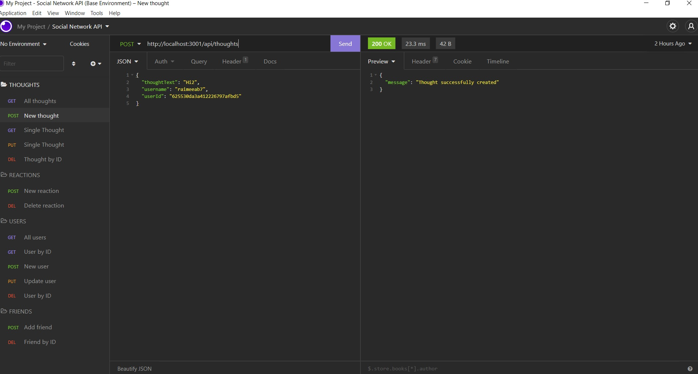

# Social Network API

## Video Walkthrough
https://www.youtube.com/watch?v=oSr_cLP2FHU

## Summary
MongoDB based API for social media startup 
  

## Description 
An application for seeding, updating, and modifying social network data. 

Using MongoDB via NodeJS, a social media database consisting of Users, Thoughts, and reactions are seeded and interlinked.  

Using Insomnia: This data can be viewed and modified.
  

## Instructions

### Pre-requisites
Visual Studio to run code.  
Node.js installed 
MongoDB installed 
Insomnia installed 
 

### NPM Installations
NPM install: express
 

### Execution: Insomnia
Use the following method/address combinations to access/edit the application database:

Thoughts: 
GET, POST: http://localhost:3001/api/thoughts 
GET/PUT/DEL single thought: http://localhost:3001/api/thoughts/:thoughtId 

Reactions: 
POST/DEL:  http://localhost:3001/api/thoughts/1/reactions 

Users: 
GET/POST: http://localhost:3001/api/users 
GET/PUT/DEL single user: http://localhost:3001/api/users/1 

Friends: 
POST/DEL: http://localhost:3001/api/users/1/friends/1 

## Contact
grimdango@gmail.com
 
## Log 

### 16/04/22
Comprehensive code revisions and testing on Insomnia

### 14/04/22
Branches merged

### 13/04/22
Routes, seeds and schemas overhauled

### 09/04/22
Created branch for alternate routing 

### 07/04/22
Initial routing.

### 06/04/22
Initiated project, initial modelling.

   

